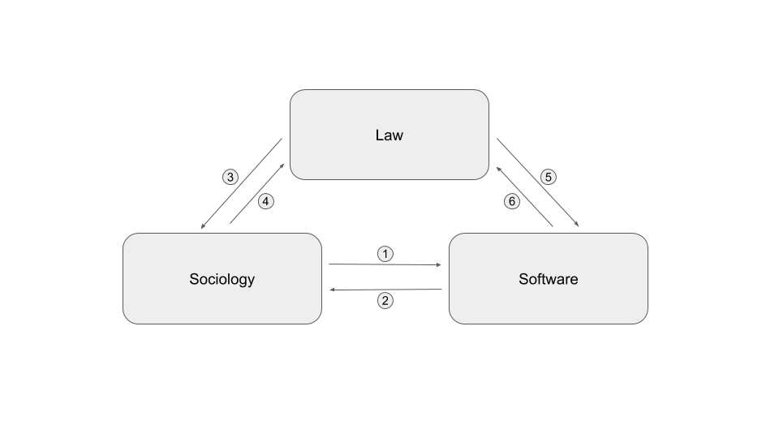

Profile is a [CominLabs](http://www.cominlabs.ueb.eu/) project.

**Goal**: Analyzing	and	mitigating	the	risks	of	online	profiling:	building	a	global
perspective	at	the	intersection	of	law,	computer	science	and	sociology

- **Participants** : ASAP team (INRIA), DiverSE team (INRIA), DRUID team (IRISA), IODE
(Université de Rennes 1), PREFics (Université de Rennes 2).
- **External collaborator** : Sébastien Gambs (Université du Québec à Montréal, Canada)

## Challenge

> Which legal and technical instruments can be offered to individuals to protect their
fundamental rights at controlling the extent to which they are profiled online?

From a legal standpoint, the European Union is working to reform the system for personal
data protection by replacing Directive 95/46/EC3 by a Regulation, whose first draft resulted in the proposal of 25 January 2012, amended by the European Parliament in 2014, and which aims to strengthen the rights of individuals with respect to their personal data. The final version is expected by the end of 2015. PROFILE aims at complementing these regulatory efforts by analyzing the practice of consent on data usage and the general terms and conditions proposed by service providers. The ultimate goal will consist in a legal framework that enables users to understand how their data is being used thereby improving the transparency of provided services.

## Technical research

From a technical standpoint, PROFILE aims at investigating how to reconstruct the inner
process of algorithms that exploit the information contained in user profiles. Our main
objective is to make algorithms more accountable by increasing their transparency and
opening them to the scrutiny of the public. In particular, we envision setting up a
crowdsourcing platform in which users would directly contribute with their data without
giving away their right to privacy. We also aim at providing effective tools to mitigate
profiling. In this context, we focus on adapting the software diversification principles to
protect against browser fingerprinting. Browser fingerprinting is a concrete and
immediately relevant technology, which is currently not regulated at all. It has recently
emerged as a powerful alternative to cookies for profiling and delivering targeted advertising.
The study of browser fingerprinting is highly relevant for PROFILE because (1) it is
extremely versatile and (2) currently there exists no effective protection against it. Its
versatility comes from its simplicity: it consists in remotely collecting and storing information
about a user’s browser. The complexity of modern browsers means that they directly provide
unregulated access to hundreds of browser properties, ranging from the browser type to the
status of the battery. While many existing browsers typically share individual properties, their
combination acts a quasi-identifier and results in a statistically unique fingerprint that can be
used for profiling. Unfortunately, the information contained in fingerprints is also needed for
genuine and honest purposes, such as portability and usability (which originally motivated
their introduction). Being able to disentangle genuine use from fingerprinting by analyzing the
means of collection (usually in the form of obfuscated scripts in web pages) is therefore
essential to characterize the risks for privacy. The versatile nature of fingerprinting also poses
the major scientific challenge of devising effective mitigation techniques.

## Results

Final report is available <a href="docs/final_report.pdf"> here </a>

The Profile cominlabs project has been running for 3 years. It is a truly interdisciplinary where computer scientists, lawyers and sociologists interact to address the problem of online profiling.
This project has produced various main contributions which are currently synthesized in a book entitled “Online profiling: between liberalism and regulation” (written in french). This book will be published in November and accompanied by a conference which will be held on Friday 27th of september 2019 in Rennes. This conference will synthesized the works made by the project and confront our ideas with other internationally recognized researcher  working on the domain of private data and profiling.  
One of the main result of the Profile project comes from the PhD Thesis of Pierre Laperdrix (his PhD was not funded by the project but he worked closely with us) which won the 2018 INRIA/CNIL price “Privacy protection” for his article “Beauty and the Beast: Diverting modern web browsers to build unique browser fingerprints” and the accesit to the Gilles Kahn 2018 Phd thesis price for his thesis "Browser Fingerprinting Exploring Device Diversity to Augment Authentication and Build Client-Side countermeasures"

### Context
The profile cominlabs project has been studying online profiling for the last three years. The project is truly interdisciplinary with software computer scientists, lawyers and sociologists. We have been studying the envision impact and technical abilities of online profiling together with the tools to protect against this type of profiling both from a socio-technical and law point of view.

To carry out this research, the project includes three disciplinary fields that interacted together as shown in the diagram below. Each arrow corresponds to a type of exchange between two disciplinary fields. The nature of these exchanges  is considered as a lesson learned from this project and is detailed below:
1. Sociologists have interacted with computer scientists by studying the reactions of the general public to the phenomenon of online profiling and by highlighting the privacy paradox.
2. The computer scientists interacted with the sociologists to define the specifications and co-develop a system to study the traces left by the use of a smartphone.  
3. Jurists have interacted with sociologists on the conditions for possible free and informed consent to profiling
4. In-house lawyers interacted with computer scientists to identify and qualify the data involved in profiling.
5. Sociologists and jurists worked on framework for the CGU of a future application aimed to collect data from users’ smartphones.
6. Sociologists have presented their results to explicit the concept of “resigned” consent to jurists

### Contributions
Our contributions are organized into two themes :
- **The privacy and profiling paradox**: which state that most people really care about their privacy, but on the other hand they agree to give all their private data to access various services.
- **Profiling regulation**: the computer and legal control instruments enabling users to understand what the operator does with their data.

### Theme 1 : The privacy and profiling paradox

#### 1st Contribution : Risks perception analysis from a sociologue point of view.
Relationships between users and smartphone collected-datas are our main focus point in this study. In that way, we developed a methodology based on users dataselves auto-confrontation.

While studies explaining those relationships can be analyzed through what is called Privacy Paradox (which balanced the users’ willingness to be protected against data gathering, and their practices generating collected data), we suggest that framing the question in this way is problematic because users are far from being enlightened as to what they have agreed to. When they noticed the variety and the quantity of collected-datas on them and their practices, the reactions we observed show most of the time: surprise and fears.

**Observation and lessons learned** : We noted that most consent were resigned consent and most users were trying to implement a protection scheme against data profiling but they had the impression they lack the tools and knowledge to be efficiently protected. These observation justify the need and drive the development of tools to protect user privacy.

#### 2nd Contribution  "Risk assessment of recidivism. An occurrence of criminal profiling".

What are the occurrences of criminal profiling? Rather than an overview, the choice was made to analyse an emblematic case of profiling and the evolution of criminal law at the same time: the assessment of the risk of recidivism. Increasingly, the old fear of new crimes being committed by offenders is leading contemporary legislators to reorient the functions of sentencing and criminal procedure. From the punishment of the past offence, the system shifts, at least in part, towards managing the risk of a future offence. Carried out at low noise, against the background of the challenges of this paradigmatic break in terms of fundamental freedoms, this evolution is promoted by new technologies, especially the application of algorithms for the purpose of profiling individuals. However, to date, it has not attracted much interest from legal researchers, especially in France.

**Observation and lessons learned** : In addition to a contribution relating to profiling in an interdisciplinary context, this study contribute to the development of the analysis of this neglected legal-political phenomenon.

### Theme 2 : Profiling regulation

#### 1st contribution : The DGPR's legal safeguards against discriminatory profiling practices

Profiling is an essential concept aimed by the data protection regulation. In many country, it was because of the profiling that a data protection law was adopted. Naturally, the GDPR deal with this notion. Article 4 § 4 of the European regulation define it, and article 22 prohibit the use of profiling. However, the prohibition is not as clear as it seems and the goal of this contribution is to show why.
First of all, article 22 prohibit every automated individual decision-making, not only profiling. Yet, the text of this article doesn’t implement a general prohibition of these techniques. It implement a right for the person. That is to say that “the data subject shall have not right not to be subject to a decision solely based on an automated processing”. Many information can be extract from this wording.
On one hand, the data subject have, indeed, a concrete right to oppose to an automated processing. But, on the other hand, the sentence contain, in itself, the exception to the rule. If a human being can act on the processing, or on the decision, it means that the processing is not solely based on an automated decision. So the processing, is lawful.
The other main right related to the profiling is the right to object to the processing. Once again, this right is not absolute because many exception are practical.
An other exception to the profiling is the consent of the data subject. The consent, perceive as a protective right for the data subject, can mainly be a breach in data protection regulation. Many protective principle of the GDPR, like the prohibition of processing sensitive data, can be sidelined by the consent of the data subject.

**Observation and lessons learned** : All of these exceptions to the prohibition of profiling, and every concept approach in this contribution reveal the complexity of the profiling regulation.

#### 2nd contribution :  Framing profiling in the General Data Protection Regulation (GDPR) in the light of European instruments for the protection of fundamental rights

This contribution analyses the framework of profiling carried out by the General Data Protection Regulation (GDPR) of 2016 in the light of European instruments for the protection of fundamental rights, namely, on the European Union (EU) side, the EU Charter of Fundamental Rights 2000 and the Council of Europe, the European Convention on Human Rights (ECHR) of 1950 and the Convention for the Protection of Persons in Respect of Automated Processing of Personal Data of 1981. It should be noted that the latter Convention, known as Convention 108, will be examined in parallel with its modernized version, the so-called “108 + Convention”, even though the latter is not yet in force.

This contribution assesses the degree of alignment of the GDPR profiling framework with the European body of fundamental rights protection. The examination shall be based on the content of the relevant GDPR pivot article, namely Article 22 entitled "Automated individual decision, including profiling", even if, on the one hand, this article does not concern only the profiling hypothesis and, on the other hand, not all profiling hypotheses are limited to the content of this article. If Article 22 specifies in its § 1 that the person concerned has the right not to be the subject of a decision based exclusively on automated processing, including profiling, producing legal effects on it or significantly affecting it in a similar way”, it then provides for exceptions to this right whose conformity with fundamental rights must be assessed (first part of the contribution) and it accompanies them with a number of guarantees whose articulation with fundamental rights must be examined (second part of the contribution).

**Observation and lessons learned** : Thanks to the convergence of the GDPR and the European instruments for the protection of fundamental rights, Internet users benefit from protection against profiling by web giants.

#### 3rd contribution : Instruments for regulating connected objects in health insurance

This contribution has two components. On the one hand, we have carried out a legal inventory of the situation on connected object links and health insurance and, on the other hand, we have considered what possible profiling practices based, in particular, on the data produced by connected objects may change in the field of health insurance. This raises the question of the legal regulations to be built for the protection of the insured person and the ethical use of data.

**Observation and lessons learned** : If the proposed law tabled on 23 January 2019, aimed at prohibiting the use of personal data collected by connected objects in the insurance field, does not result, the processing of personal data could become an instrument of differentiation in the market of health and/or provident insurance.

#### 4th contribution : Mitigating browser Fingerprinting
Browser fingerprinting is a technique that collects information about the browser configuration and the environment in which it is running. This information is so diverse that it can partially or totally identify users online.  Over time, several countermeasures have emerged to mitigate tracking through browser fingerprinting.  However, these measures do not offer full coverage in terms of privacy protection, as some of them may introduce inconsistencies or unusual behaviors, making these users stand out from the rest.

**Observation and lessons learned** : We address these limitations by proposing a novel approach that minimizes both the identifiability of users and the required changes to browser configuration. To this end, we exploit clustering protocols to identify the devices that are prone to share the same or similar
fingerprints and to provide them with a new non-unique fingerprint. We then use this fingerprint to automatically "reconfigure" the devices by running a browser within a docker container. Thus all the devices in the same cluster will end up running a dockerized browser with the same indistinguishable and consistent fingerprint.

#### 5th contribution :  Open the black box of customization algorithms
The ever-increasing amount of personal data collected by profiling systems, online or not, is fueling the real-life implementation of highly personalized online services based on recent successful machine learning techniques such as deep neural networks. In a nutshell, these techniques input a detailed personal profile (ex : browsing history, or socio-demographic information with possible criminal background) and typically output a prediction (ex : a list of suggested products, or a score that quantifies the risk of recidivism). Despite the fact that these systems are used widely and intensively, their inner working is often opaque, both about the exact information they use and about the operations performed. Given that these systems may suffer from various biases (sometimes involuntarily) while they may impact strongly some individuals (ex : the result of judgment) it is crucial to be able to put them under scrutiny.

**Observation and lessons learned** : We advocate for a two-step approach that consists (1) in gathering pairs of (input, output) to/from these systems (ex : by constructing profiles and observing the resulting suggestions or prices) in order to (2) construct a human-understandable view of the way the system under study maps the inputs to the outputs. To the best of our knowledge, the existing methodologies for collecting data from these systems disclose information in an uncontrolled manner which may lead to a biased output for a given input. Proposing a robust methodology that limits the side leaks is thus our objective with respect to the first step. We have designed the methodology and are currently implementing it. The second step is related to explaining machine learning algorithms. Related works are numerous. As a preliminary study we have built a decision tree over the COMPAS dataset that contains profiles of criminals together with various predicted risks (ex : violent recidivism).

## Publications

### Profile Book production

**Books on Profiling** (profilage in French), éditeur Mare et Martin  (direction S. Turgis, A. Bensamoun et M. Boizard)

- Marine Gout, Florian Hemont, “Consentement résigné : en finir avec le Privacy Paradox” Editor Mare et Martin and was presented in several invited talk at different venues.

- Johann Bourcier “Profiling on mobile phones. Computer tool for identifying traces and reconstructing pieces of life.” Editor Mare et Martin

- Laurent Rousvoal, “L’évaluation du risque de récidive, Une occurrence du profilage en matière pénale”, Editor Mare et Martin

- Maryline Boizard, Erwan Picart, “Les garanties juridiques du RGPD contre les pratiques discriminatoires de profilage”, editor Mare et Martin;

- Sandrine Turgis : “L’encadrement du profilage dans le règlement général sur la protection des données (RGPD) à l’aune des instruments européens de protection des droits fondamentaux” Editor Mare et Martin

- Marion Del Sol, “Les instruments de régulation des objets connectés en matière d’assurance santé”, Editor Mare et Martin;

- Benoît Baudry, Davide Frey, Alejandro Gomez Boix, “ La régulation par le « contrôle informatique » : le Browser fingerprinting”, Editor Mare et Martin;

- Tristan Allard, Sébastien Gambs, Julien Lolive, “Ouvrir la boîte noire des algorithmes de personnalisation”, editor Mare et Martin;

- Margaux Redon, Les incertitudes juridiques entourant les données issues des objets connectés en santé, Editor Mare et Martin

**Books on Le règlement général sur la protection des données, aspects institutionnels et matériels**, (in French) Mare et Martin, 2019, (direction A. Bensamoun)

### International Conferences

- M. Del Sol, Enjeux juridiques des objets connectés en matière d’assurance santé. Réflexions à partir et au-delà du cadre français – 23ème colloque de l’Association Information & Management (Montréal, Canada, mai 2018);

- Alejandro Gómez-Boix, Pierre Laperdrix, Benoit Baudry: Hiding in the Crowd: an Analysis of the Effectiveness of Browser Fingerprinting at Large Scale WWW 2018: The 2018 Web Conference : 2018;
International workshop

- Maryline Boizard: Protection des algorithmes et sécurité juridique des personnes Workshop international sur la sécurité globale : 2017;

- M. Del Sol, Les enjeux juridiques et éthiques des objets connectés en matière d’assurance santé – Université d’été pluridisciplinaire et internationale « Travail et innovations technologiques » (Bordeaux, juill. 2018);

- Marion Del Sol, Margaux Redon: “M-health: the legal issues of connected objects”, CYBER SECURITY AND HEALTHCARE,  2017

- T. Allard : Towards Using Differential Privacy as a Building Block for Privacy-Preserving Algorithms. In Shonan Meeting n°116 : Anonymization methods and inference attacks: theory and practice. Shonan Center, Japan, 2018;

- Tristan Allard, Davide Frey, George Giakkoupis, Julien Lepiller: Lightweight Privacy-Preserving Averaging for the Internet of Things : 2016

- Alejandro Gómez-Boix, Davide Frey, Yérom-David Bromberg, Benoit Baudry, “A Collaborative Strategy for mitigating Tracking through Browser Fingerprinting”, to appear in Moving Target Defense (MTD) workshop at the 26 ACM Conference on Computer Security (ACM CCS 2019)

- A. Bensamoun, « AI and data privacy », UNESCO International Symposium, Mobile Learning Week, plénière Safeguarding transparent and auditable use of education data, UNESCO (Paris), 7 mars 2019;

### French workshop
- Maryline Boizard: Les garanties juridiques du règlement européen sur la protection des données personnelles contre les pratiques discriminatoires des algorithmes et des plateformes numériques Journée d’étude : Les discriminations à l'ère de la société numérique : 2017;

- Maryline Boizard: La protection des droits fondamentaux des migrants et des réfugiés : durée de conservation des données collectées aux frontières Journée d’étude Les données numériques des migrants et des réfugiés : 2017

- Alejandro Gómez-Boix, Pierre Laperdrix, Benoit Baudry: Fingerprinting mobile devices: A short analysis CIEL 2017 - 6ème Conférence en IngénieriE du Logiciel : 2017;

- A. Bensamoun « IA : éthique, confiance et responsabilité », Table ronde « Le Droit comme outil de sécurisation », colloque Cyberlex La sécurité dans un monde de transformation numérique, Palais du Luxembourg, 15 janv. 2018.
Related work published during Profile by people from the Profile project

- A. Boutet, F. De Moor, D. Frey, R. Guerraoui, A. Kermarrec, A. Rault: Collaborative Filtering Under a Sybil Attack: Similarity Metrics do Matter! Dependable Systems and Networks (DSN) : 2018;

- Pierre Laperdrix, Benoit Baudry, Vikas Mishra: FPRandom: Randomizing core browser objects to break advanced device fingerprinting techniques ESSoS 2017 - 9th International Symposium on Engineering Secure Software and Systems : 2017;

- Nicolas Harrand and Benoit Baudry: Software Diversification as an Obfuscation Technique, International Workshop on obfuscation : 2017;
Benoit Baudry: How can we reconcile diversity and privacy? Dagstuhl seminar on Online Privacy and Web Transparency : 2017;

- A. Boutet, F. De Moor, D. Frey, R. Guerraoui, A. Kermarrec and A. Rault, "Collaborative Filtering Under a Sybil Attack: Similarity Metrics do Matter!," 2018 48th Annual IEEE/IFIP International Conference on Dependable Systems and Networks (DSN), Luxembourg City, 2018, pp. 466-477.

- Beauty and the beast: Diverting modern web browsers to build unique browser fingerprints P Laperdrix, W Rudametkin, B Baudry
Security and Privacy (SP), 2016 IEEE Symposium on, 878-894

- libmask: Protecting browser JIT engines from the devil in the constants
M Mishra, B Baudry Privacy, Security and Trust (PST), 2016 14th Annual Conference on, 301-308

### oral presentation

- Alejandro Gómez-Boix, Pierre Laperdrix and Benoit Baudry. Fingerprinting mobile devices: A short analysis. Oral presentation at CIEL'2017.

### Public outreach:

- B. Baudry talked about online privacy and browser fingerprinting at the 'Pint of science' science festival (**2017**)
- B. Baudry will talked about online privacy and browser fingerprinting at the 'Science en bobines' festival (**2017**)

## Contacts
- [Sandrine Turgis](mailto:sandrine.turgis@univ-rennes1.fr)
- [Johann Bourcier](mailto:johann.bourcier@irisa.fr)

<a href="https://profile.diverse-team.fr" class="github-corner"><svg width="80" height="120" viewBox="0 0 400 400" style="fill:#151513; color:#fff; position: absolute; top: 0; border: 0; right: 0;">
	<g transform="translate(-217.125,-92.125)">
		<circle r="155" cy="250" stroke="#000" cx="375" stroke-miterlimit="10" stroke-width="5.75" fill="#fff"/>
		<g>
			<circle r="100" cy="250" stroke="#c0c0c0" cx="375" stroke-miterlimit="4.5" stroke-width="4.5" fill="none"/>
			<defs>
				<circle id="a" cy="250" cx="375" r="100"/>
			</defs>
			<clipPath id="b">
				<use overflow="visible" xlink:href="#a"/>
			</clipPath>
			<g clip-path="url(#b)" stroke="#c0c0c0" stroke-miterlimit="4.5" stroke-width="4.5" fill="none">
				<ellipse rx="62.5" cy="250" ry="100" cx="375"/>
				<ellipse rx="26.5" cy="250" ry="100" cx="375"/>
				<circle r="130" cy="444" cx="375"/>
				<circle r="260" cy="538" cx="375"/>
				<circle r="130" cy="56" cx="375"/>
				<circle r="260" cy="-38" cx="375"/>
				<line y2="250" x1="275" x2="475" y1="250"/>
				<line y2="350" x1="375" x2="375" y1="150"/>
			</g>
		</g>
		<g>
			<g>
				<path d="M285.3,361.56c2.42,1.82,9.79,6.26,20.4,6.26,22.82,0,25.55-14.14,54.53-14.14,22.93,0,43.63,18.48,53.52,27.87l-6.26,5.45c-3.63-5.05-23.83-29.28-44.23-29.28-13.02,0-22.92,19.19-46.45,19.19-17.87,0-27.57-9.89-31.51-15.35z"/>
				<path d="M342.28,353.74c-10.2-0.25-25.04,7.89-39.98,7.57-11.92-0.25-33.12-6.41-41.05-24.69,4.8,5.35,11.74,12.55,33.17,12.72,13.02,0.1,24.94,3.64,29.23,3.64-5.91-1.51-12.54-3.82-17.87-8.94-5-4.8-10.45-20.55-14.54-25.3,7.42,3.23,21.76,19.69,27.52,24.54,9.42,7.94,13.83,8.08,23.52,10.46z"/>
				<path d="M304.72,346.82c-10.2-2.02-30.97-5.69-35.95-8.89-8.18-5.25-25.85-15.04-29.08-37.16,3.33,8.28,13.33,17.57,27.47,23.13,12.88,5.06,18.38,12.01,25.75,16.16-5.75-4.34-9.7-9.39-12.72-14.74-5.19-9.17-4.44-31.2-9.49-37.56,8.28,7.57,15.26,22.85,17.27,28.78,4.13,12.21,8.37,25.53,16.75,30.28z"/>
				<path d="M276.75,324.71c-5.76-5.96-28.18-16.66-33.53-24.64-5.42-8.07-15.15-15.55-12.52-39.28,0.49,8.91,6.08,17.38,17.17,27.77,8.08,7.57,12.91,18.53,18.56,24.83-4.05-5.96-6.82-12.93-7.96-18.97-1.96-10.35,5.96-28.2,3.23-35.85,5.4,9.83,6.88,26.05,6.87,32.31-0.02,12.9,3.63,28.07,8.18,33.83z"/>
				<path d="M254.83,291.28c-5.35-10.4-19.89-22.72-22.21-35.04-1.8-9.55-5.05-19.9,2.12-37.26-1.52,8.58,0.04,18.37,6.67,30.8,6.56,12.32,5.35,22.52,8.18,27.11-1.48-7.06-1.4-14.55-0.16-20.58,2.12-10.32,13.99-20.17,14.8-30.87,1.21,10.2-2.31,25.48-4.34,31.4-4.65,13.54-6.97,19.99-5.06,34.44z"/>
				<path d="M246.96,254.21c-1.31-12.72-10.2-27.87-9.7-40.19,0.39-9.71,0.88-18.26,13.13-32.52-4.54,8.18-4.44,14.88-2.83,28.88,1.52,13.13-1.35,23.53-0.1,28.78,0.5-10.3,2.72-15.11,6.46-19.99,6.97-9.09,16.76-12.92,19.09-20.4-0.21,8.18-5.91,19.95-9.7,24.94-8.64,11.4-14.94,16.77-16.35,30.5z"/>
				<path d="M250.64,219.4c2.66-12.51-2.01-24.75,1.37-34.66,2.82-8.28,6.86-16.76,20.7-21.01-4.24,2.33-9.88,10.18-10.5,15.86-1.61,14.64-6.54,20.98-6.97,26.36,3.23-8.89,8.47-13.27,13.53-16.77,9.42-6.51,14.34-10.7,17.27-17.26-0.3,8.38-5.35,18.88-12.42,24.03-11.56,8.42-20.2,16.46-22.98,23.45z"/>
				<path d="M300.78,150c-4.75,2.32-19.09,6.26-25.55,13.83-8.65,10.13-8.49,19.19-11.61,24.84,5.35-4.34,15.55-11.71,18.98-16.87,3.44-5.14,9.39-14.63,18.18-21.8z"/>
			</g>
			<g>
				<path d="M464.7,361.56c-2.42,1.82-9.79,6.26-20.4,6.26-22.82,0-25.55-14.14-54.53-14.14-22.93,0-43.63,18.48-53.52,27.87l6.26,5.45c3.63-5.05,23.83-29.28,44.23-29.28,13.02,0,22.92,19.19,46.45,19.19,17.87,0,27.57-9.89,31.51-15.35z"/>
				<path d="M407.72,353.74c10.2-0.25,25.04,7.89,39.98,7.57,11.92-0.25,33.12-6.41,41.05-24.69-4.8,5.35-11.74,12.55-33.17,12.72-13.02,0.1-24.94,3.64-29.23,3.64,5.91-1.51,12.54-3.82,17.87-8.94,5-4.8,10.45-20.55,14.54-25.3-7.42,3.23-21.76,19.69-27.52,24.54-9.42,7.94-13.83,8.08-23.52,10.46z"/>
				<path d="M445.28,346.82c10.2-2.02,30.97-5.69,35.95-8.89,8.18-5.25,25.85-15.04,29.08-37.16-3.33,8.28-13.33,17.57-27.47,23.13-12.88,5.06-18.38,12.01-25.75,16.16,5.75-4.34,9.7-9.39,12.72-14.74,5.19-9.17,4.44-31.2,9.49-37.56-8.28,7.57-15.26,22.85-17.27,28.78-4.13,12.21-8.37,25.53-16.75,30.28z"/>
				<path d="M473.25,324.71c5.76-5.96,28.18-16.66,33.53-24.64,5.42-8.07,15.15-15.55,12.52-39.28-0.49,8.91-6.08,17.38-17.17,27.77-8.08,7.57-12.91,18.53-18.56,24.83,4.05-5.96,6.82-12.93,7.96-18.97,1.96-10.35-5.96-28.2-3.23-35.85-5.4,9.83-6.88,26.05-6.87,32.31,0.02,12.9-3.63,28.07-8.18,33.83z"/>
				<path d="M495.17,291.28c5.35-10.4,19.89-22.72,22.21-35.04,1.8-9.55,5.05-19.9-2.12-37.26,1.52,8.58-0.04,18.37-6.67,30.8-6.56,12.32-5.35,22.52-8.18,27.11,1.48-7.06,1.4-14.55,0.16-20.58-2.12-10.32-13.99-20.17-14.8-30.87-1.21,10.2,2.31,25.48,4.34,31.4,4.65,13.54,6.97,19.99,5.06,34.44z"/>
				<path d="M503.04,254.21c1.31-12.72,10.2-27.87,9.7-40.19-0.39-9.71-0.88-18.26-13.13-32.52,4.54,8.18,4.44,14.88,2.83,28.88-1.52,13.13,1.35,23.53,0.1,28.78-0.5-10.3-2.72-15.11-6.46-19.99-6.97-9.09-16.76-12.92-19.09-20.4,0.21,8.18,5.91,19.95,9.7,24.94,8.64,11.4,14.94,16.77,16.35,30.5z"/>
				<path d="M499.36,219.4c-2.66-12.51,2.01-24.75-1.37-34.66-2.82-8.28-6.86-16.76-20.7-21.01,4.24,2.33,9.88,10.18,10.5,15.86,1.61,14.64,6.54,20.98,6.97,26.36-3.23-8.89-8.47-13.27-13.53-16.77-9.42-6.51-14.34-10.7-17.27-17.26,0.3,8.38,5.35,18.88,12.42,24.03,11.56,8.42,20.2,16.46,22.98,23.45z"/>
				<path d="M449.22,150c4.75,2.32,19.09,6.26,25.55,13.83,8.65,10.13,8.49,19.19,11.61,24.84-5.35-4.34-15.55-11.71-18.98-16.87-3.44-5.14-9.39-14.63-18.18-21.8z"/>
			</g>
		</g>
		<g>
			<circle cy="222" cx="375" r="5.25"/>
			<path d="M388.23,197.59c1.17-1.73,1.76-3.62,1.76-5.65,0-4.05-2.91-10.14-13.42-10.14-9.83,0-13.07,5.7-13.07,9.5,0,2.87,1.9,4.62,4.46,4.62,2.19,0,3.95-1.47,3.95-3.69,0-2.61-2.09-4.65-2.09-5.81,0-0.96,1.49-2.4,4.02-2.4,2.09,0,5.91,1.32,5.91,8.31,0,9.41-5.45,8.99-5.45,18.82v0.98h1.4c0.16-2.27,0.58-3.95,1.28-5.04,0.72-1.11,2.21-2.38,4.46-3.79,3.36-2.1,5.62-4,6.79-5.71z"/>
		</g>
		<g>
			<polygon fill="#fff" points="394,297,394,245,390,241.5,385.8,239.31,384.45,238.65,378.05,235.5,371.95,235.5,365.55,238.65,364.2,239.31,360,241.5,356,245,356,297"/>
			<path d="M380.63,296.84l-0.35-17.22c-0.17-3.27-0.24-6.53-0.51-9.79-0.71-4.63-2.83-8.94-3.26-13.62,0.55-0.67,1.15-1.28,1.77-1.89,2.65,1.28,3.05,3.86,5.36,5.84-0.6-2.36-2-4.42-2.92-6.66-1.17-2.1-1.89-4.61-4.04-6.02,1.4-0.82,2.93-1.37,4.38-2.08,2.54-1.16,5.29-2.21,7.33-4.14,0.04-0.15,0.04-0.27,0.03-0.39l1.13,0.67c0.4,1.19,0.9,2.33,1.3,3.52,0.17,0.5,0.25,1.02,0.25,1.54,0,0.97-0.28,1.95-0.79,2.79,0.27,1.77,1.16,3.43,1.76,5.12,1,2.53,1.25,5.26,1.38,7.95,0.11,0.67,0.16,1.37,0.16,2.04,0,12.69-8.42,26.57-12.98,32.34zm-24.24-32.34c0-0.67,0.05-1.37,0.16-2.04,0.13-2.69,0.38-5.42,1.38-7.95,0.6-1.69,1.49-3.35,1.76-5.12-0.51-0.84-0.79-1.82-0.79-2.79,0-0.52,0.08-1.04,0.25-1.54,0.4-1.19,0.9-2.33,1.3-3.52l1.13-0.67c-0.01,0.12-0.01,0.24,0.03,0.39,2.04,1.93,4.79,2.98,7.33,4.14,1.45,0.71,2.98,1.26,4.38,2.08-2.15,1.41-2.87,3.92-4.04,6.02-0.92,2.24-2.32,4.3-2.92,6.66,2.31-1.98,2.71-4.56,5.36-5.84,0.62,0.61,1.22,1.22,1.77,1.89-0.43,4.68-2.55,8.99-3.26,13.62-0.27,3.26-0.34,6.52-0.51,9.79l-0.35,17.22c-4.56-5.77-12.98-19.65-12.98-32.34zm60.14,91.7c4.06-2.61,8.38-4.81,12.42-7.45l4.77-3.06c2.4-1.38,4.29-3.38,6.45-5.06,0.4-2.37,0.62-4.75,1.07-7.11v-7.13c-0.34-1.19-0.08-2.43-0.34-3.63-0.24-3.81-0.51-7.65-1.02-11.44-0.96-4.99-0.78-10.09-1.73-15.08-0.28-1.76-1.28-3.28-1.8-4.97,0.57-0.23,1.14-0.48,1.73-0.7-0.71-2.13-1.91-2.14-1.91-3.15,0-1.22,1.37-2.47,2.05-3.56-0.71-0.74-1.71-1.1-2.65-1.48,0.01-0.55,0.03-1.11,0.03-1.66,0-0.67-0.03-1.33-0.15-1.99-0.62-5.15-1.49-10.27-1.95-15.44-0.11-2.76-1.92-5.5-4.67-6.4-6.18-0.21-12.3-1.45-18.29-2.89-4.05-1.02-8.32-2.29-11.17-5.44-1.63-2.12-4.05-3.45-6.14-5.09-2.34-1.67-4.58-3.71-7.52-4.3,0.02,0.05,0.06,0.09,0.09,0.14l0.61,0.68c0.28,0.23,0.55,0.48,0.81,0.73-0.3,0.46-0.66,0.86-1,1.29-5.65-2.98-7.16-3.01-8.91-3.01h-4.62c-1.75,0-3.26,0.03-8.91,3.01-0.34-0.43-0.7-0.83-1-1.29,0.26-0.25,0.53-0.5,0.81-0.73l0.61-0.68c0.03-0.05,0.07-0.09,0.09-0.14-2.94,0.59-5.18,2.63-7.52,4.3-2.09,1.64-4.51,2.97-6.14,5.09-2.85,3.15-7.12,4.42-11.17,5.44-5.99,1.44-12.11,2.68-18.29,2.89-2.75,0.9-4.56,3.64-4.67,6.4-0.46,5.17-1.33,10.29-1.95,15.44-0.12,0.66-0.15,1.32-0.15,1.99,0,0.55,0.02,1.11,0.03,1.66-0.94,0.38-1.94,0.74-2.65,1.48,0.68,1.09,2.05,2.34,2.05,3.56,0,1.01-1.2,1.02-1.91,3.15,0.59,0.22,1.16,0.47,1.73,0.7-0.52,1.69-1.52,3.21-1.8,4.97-0.95,4.99-0.77,10.09-1.73,15.08-0.51,3.79-0.78,7.63-1.02,11.44-0.26,1.2,0,2.44-0.34,3.63v7.13c0.45,2.36,0.67,4.74,1.07,7.11,2.16,1.68,4.05,3.68,6.45,5.06l4.77,3.06c4.04,2.64,8.36,4.84,12.42,7.45l-3.02,41.24c21.01,3.96,30.95,6.27,39.91,7.2,1.56,0.16,3.09,0.28,4.64,0.36,1.55-0.08,3.08-0.2,4.64-0.36,8.96-0.93,18.9-3.24,39.91-7.2l-3.02-41.24z"/>
			<path d="M371.95,235c-3.79,1.22-5.5,2.59-6.4,3.65,2.32-0.73,4.49-1.85,6.89-2.35,0.86-0.17,1.69-0.26,2.56-0.28,0.87,0.02,1.7,0.11,2.56,0.28,2.4,0.5,4.57,1.62,6.89,2.35-0.9-1.06-2.61-2.43-6.4-3.65h-6.1z"/>
		</g>
	</g>

